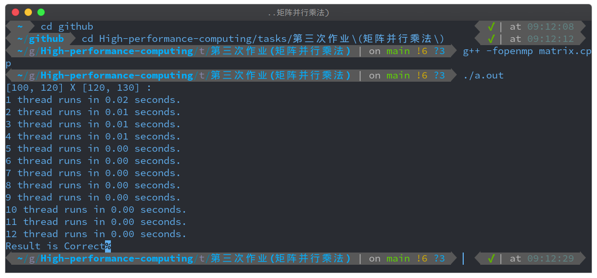
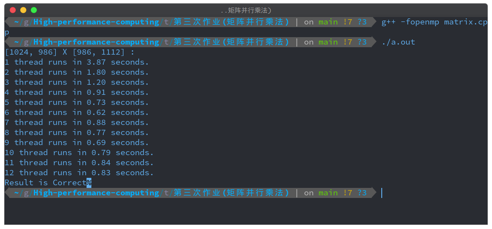
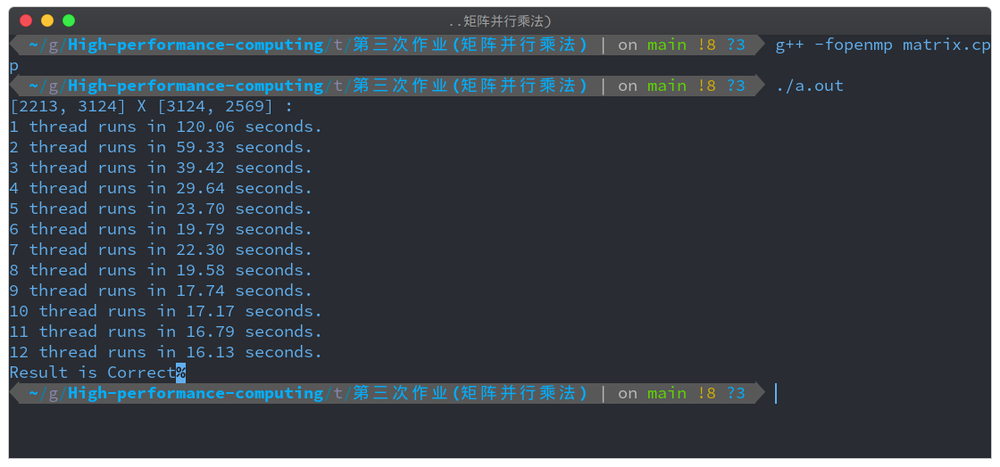

## 代码执行环境依赖：

1. gcc版本: 10.2.0
2. OS: Manjaro Linux 20.1.1
3. 物理硬件：CPU为6核12线程
4. 编译方式：`gcc -fopenmp filename.c`
5. 执行：`./a.out`

## 多线程打印 Hello World

### 结果

编写程序，编译后得到可执行文件。可执行文件运行时，进入程序当前的进程。而后在进程中创建了20个线程，且多个线程执行没有顺序关系。

### 结果分析

结果分析：线程是CPU调度和分配的基本单位。换而言之，由操作系统进行任务分配，将每个线程分配到多个CPU核心上运行。当线程被分配后开始执行，先获取资源的线程先执行，因此打印出的线程并不是顺序的。最后多个线程执行完毕后，返回主进程。

## 矩阵乘法

### 矩阵乘法实现思路：

1. 定义两个矩阵，通过宏定义将矩阵的维度定义为常数。
2. 初始化两个矩阵中的元素，类型为float，取值范围为[-2,2]。
3. 运行串行矩阵乘法，运行多线程乘法。
4. 为便于结果分析，多线程乘法分多次运行。通过 `for` 循环，2个线程运行一次，3个线程运行一次，...，12个线程运行一次，以此类推。
5. 记录两种算法的运行时间并输出，保留到小数点后两位。

### 代码说明：

- `init_randon_matrix`：初始化矩阵函数。
- `calc`：矩阵乘法计算的函数。
- `matirxMulti`：串行矩阵乘法函数。
- `matrixMultiOMP`：并行矩阵乘法函数。

### 实验结果与分析

1. 矩阵维度是 `[100, 120] X [120, 130]`

可见在数据量很小时，运行时间差异不是很明显，因此扩大数据维度，加大计算量。

2. 矩阵维度是 `[1024, 986] X [986, 1112]`

因此，只有当计算任务较大时，大于多线程之间带来的系统开销，多线程的优势才会发挥出来。因此再次提升数据维度，加大计算量，分析结果。

1. 矩阵维度是 `[2213, 3124] X [3124, 2569]`

线程越多，执行速度越快。
