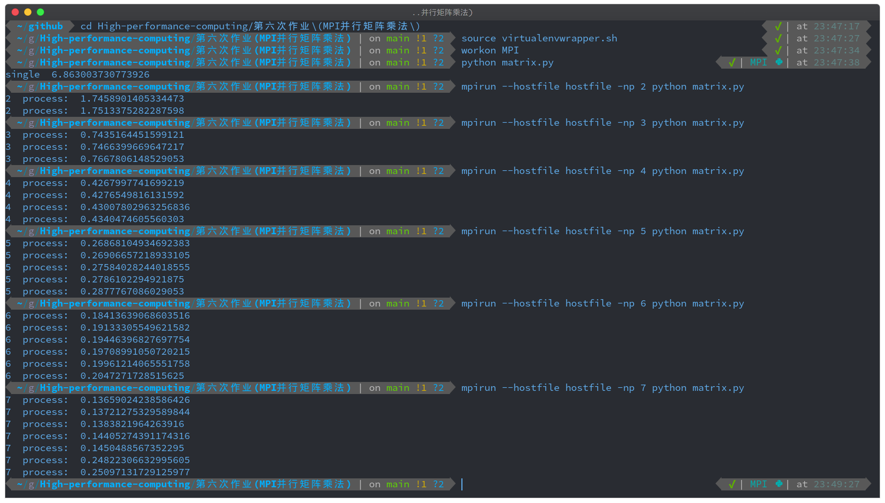
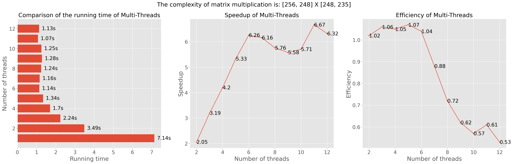

# 配置执行环境

1. 激活虚拟环境：`source virtualenvwrapper.sh`
2. 创建`python3.8`，名为`MPI`的虚拟环境：`mkvirtualenv -p /usr/bin/python3.8 MPI`
3. 进入虚拟环境：`workon MPI`
4. 安装`MPI`实现需要依赖的包：`pip install mpi4py`
5. 因`linux`的`mpi4py`禁止系统创建大量进程，否则会报错。因此在项目根目录下创建`hostfile`文件，写入`localhost slots=25`，表示最大允许创建的进程数量是25。
6. 创建4个进程时，程序执行方式：`mpirun --hostfile hostfile -np 4 python filename.py`

# 实现方案

第一个矩阵按照行划分，第二个矩阵按照列划分，按照相乘的关系，将两组矩阵按照`Scatter`的方式发送给每个进程，进程执行乘法并对结果进行汇总。对乘法时间进行记录，最后对每个进程消耗的时间进行求和，以此计算加速比。

# 实验结果

## 运行结果截图

运行结果截图如下图所示，各个步骤依次是：激活虚拟环境并进入，执行单进程乘法，执行多进程乘法。

## 加速比与执行效率

- 左侧是单进程与多进程执行时间的对比柱状图，横轴时间，纵轴是进程数量；
- 中间的是多进程的加速比，横轴是进程数量，纵轴是加速比；
- 右侧的是多进程的加速效率，横轴是进程数量，纵轴是加速效率；

可见，加速比随着进程数量的提高而呈现上升趋势，但加速效率却随之下降。所以在实际工程中，要合理的确定进程的数量。