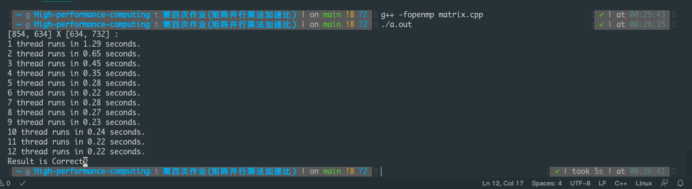
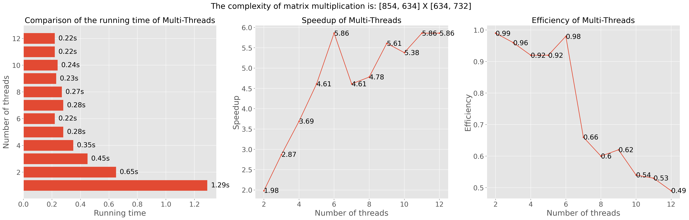
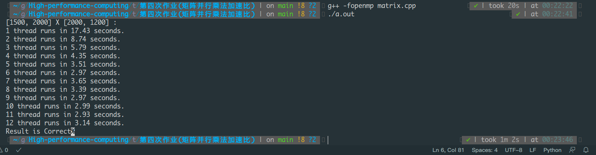
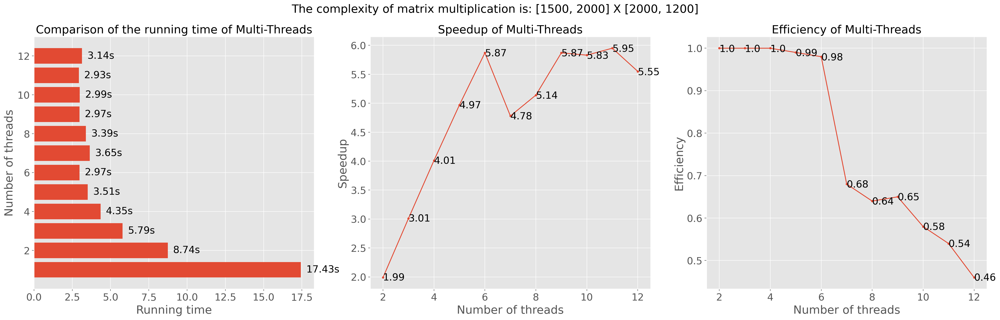

## 代码执行环境依赖：

1. g++版本: 10.2.0
2. OS: Manjaro Linux 20.1.1
3. 物理硬件：CPU为6核12线程
4. 编译方式：`g++ -fopenmp matrix.c`
5. 执行：`./a.out`

## 矩阵乘法

### 矩阵乘法实现思路：

1. 定义两个矩阵，通过宏定义将矩阵的维度定义为常数；
2. 初始化两个矩阵中的元素，类型为float，取值范围为[-2,2]；
3. 运行串行矩阵乘法，结果存储到 `r1`；运行多线程乘法，结果存储到 `r2`；
4. 为便于结果分析，多线程乘法分多次运行。通过 `for` 循环，2个线程运行一次，3个线程运行一次，...，12个线程运行一次，以此类推；
5. 记录两种算法的运行时间并输出，保留到小数点后两位；
6. 最后检查 `r1` 和 `r2` 两个矩阵是否相等。

### 代码说明：

- `init_randon_matrix`：初始化矩阵函数。
- `calc`：矩阵乘法计算的函数。
- `matirxMulti`：串行矩阵乘法函数。
- `matrixMultiOMP`：并行矩阵乘法函数。
- `judge_euqal`：判断串行和并行乘法结果是否想等函数。

### 实验结果与分析

[854, 634] X [634, 732] : 
1 thread runs in 1.29 seconds.
2 thread runs in 0.65 seconds.
3 thread runs in 0.45 seconds.
4 thread runs in 0.35 seconds.
5 thread runs in 0.28 seconds.
6 thread runs in 0.22 seconds.
7 thread runs in 0.28 seconds.
8 thread runs in 0.27 seconds.
9 thread runs in 0.23 seconds.
10 thread runs in 0.24 seconds.
11 thread runs in 0.22 seconds.
12 thread runs in 0.22 seconds.

加速比与效率：

[1500, 2000] X [2000, 1200] : 
1 thread runs in 17.43 seconds.
2 thread runs in 8.74 seconds.
3 thread runs in 5.79 seconds.
4 thread runs in 4.35 seconds.
5 thread runs in 3.51 seconds.
6 thread runs in 2.97 seconds.
7 thread runs in 3.65 seconds.
8 thread runs in 3.39 seconds.
9 thread runs in 2.97 seconds.
10 thread runs in 2.99 seconds.
11 thread runs in 2.93 seconds.
12 thread runs in 3.14 seconds.

